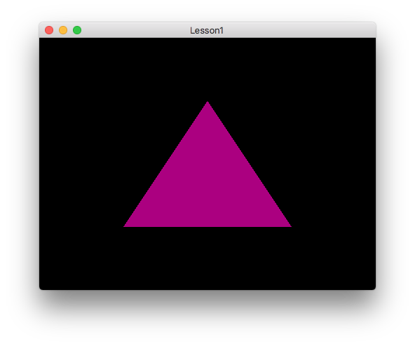
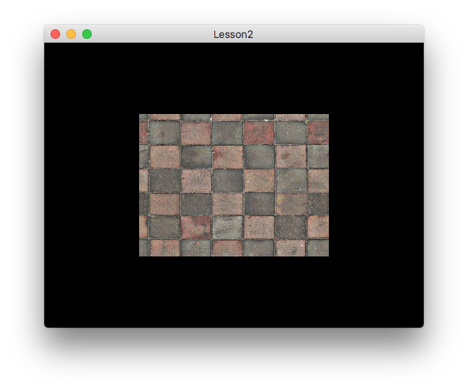
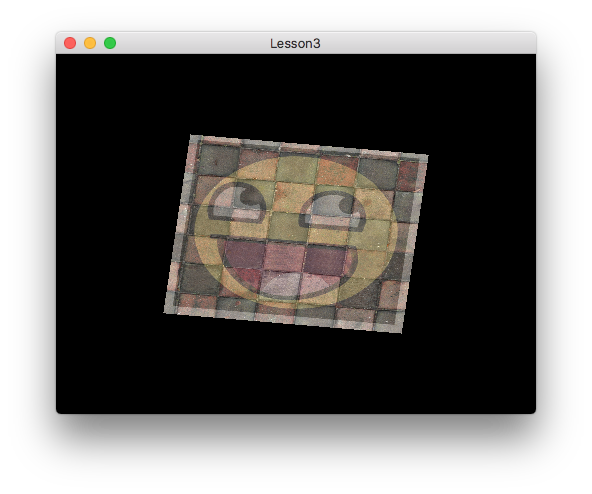
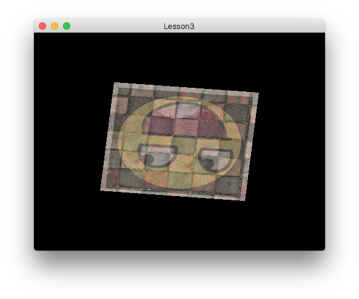
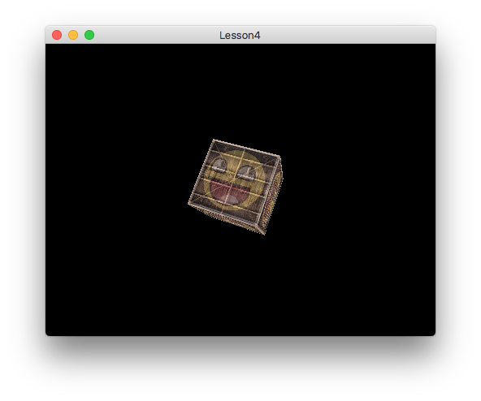
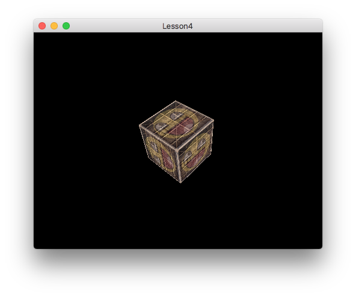
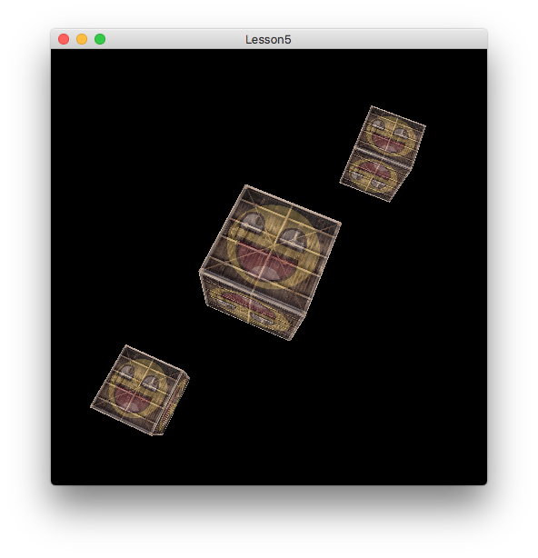

# LearnOpenGL_Mac
Learn OpenGL in Mac, used Swift, rendered by NSOpenGLView, followed [https://learnopengl.com/](https://learnopengl.com/) .

- Lesson1(OpenGL Basic、shader、NSOpenGLView)

- Lesson2(Texture)

- Lesson3(Transformations)

  

- Lesson4(Coordinate-Systems)

- Lesson5(Camera、glm Objective-C++ Wrapper)

